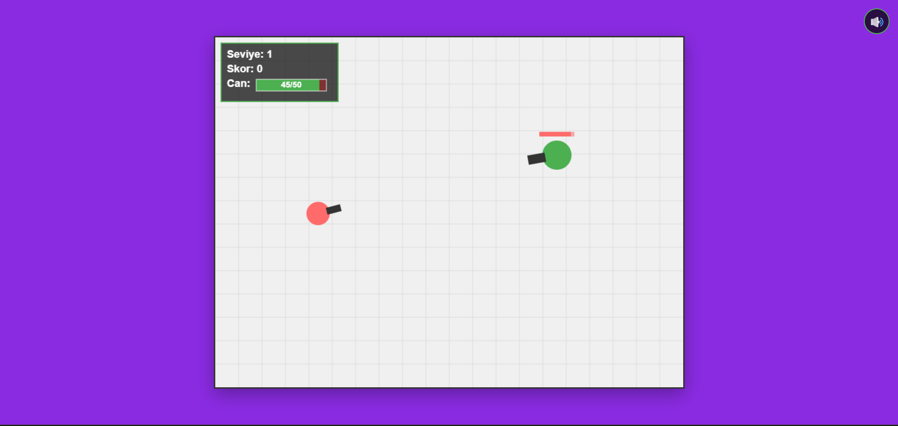
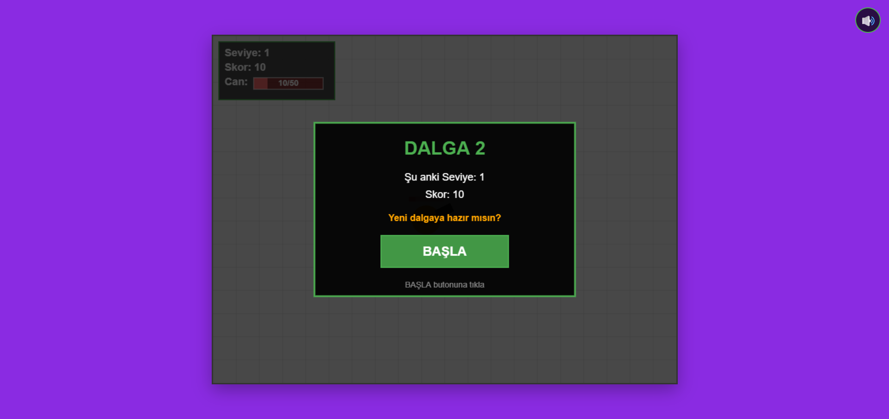
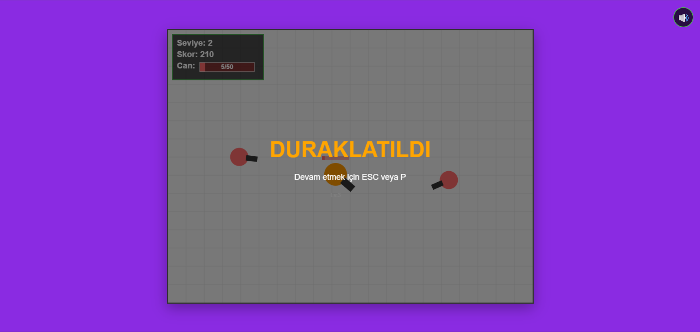

# 💣 Meltdown Barrage - Web Tabanlı Oyun

<div align="center">


**Web Tabanlı Programlama Dersi Projesi**

> 🕹️ **Oyunu Oyna:** [https://arda-dd.github.io/web_proje/](https://arda-dd.github.io/web_proje/)

</div>


## 📸 Ekran Görüntüleri

<div align="center">

### Oynanış Anı

*Oyuncunun düşmanlara karşı mücadelesi - Güç seviyesi göstergesi ve can barı ile birlikte*

### Dalga Geçiş Ekranı

*Her dalga arasında gösterilen geçiş ekranı - Skor ve yeni dalga bilgisi*

### Duraklatma Ekranı

*Durdurunca çıkan ekran*

</div>

---

## 🎯 Oyun Hakkında

Bu oyun, **pixelbrain** tarafından geliştirilen orijinal **"Meltdown Barrage"** oyununun temel mekaniklerinden esinlenerek geliştirilmiş bir **web tabanlı survival shooter** oyunudur.

> **Ana Konsept**: "Düşman dalgalarından hayatta kal ve toprağını koru. Ama çok dikkatli olma, ne kadar çok hasar alırsan o kadar güçlü olursun."

### 🎯 Oyunun Hedefi (Challenge)
**Mümkün olduğunca uzun süre hayatta kalarak en yüksek skoru elde etmek.** Düşman dalgaları her geçen seviyede daha fazla sayıda ve daha hızlı düşmanla gelir. Oyuncu, hasar aldıkça güçlenen eşsiz "Meltdown" mekaniği sayesinde risk-ödül dengesini yönetmeli; çok fazla hasar almaktan kaçınırken bir yandan da düşmanları etkisiz hale getirip puan toplamalıdır. Zorluk, her yeni dalgada artan düşman yoğunluğu ve ateş hızıyla giderek yükselir.

---

## 🎮 Oyun Mekanikleri

### ⚡ Meltdown Sistemi (Ana Mekanik)
Oyunun en önemli özelliği **hasar aldıkça güçlenme** mekaniğidir:
| Güç Seviyesi | Gereken Hasar | Mermi Hasarı | Karakter Rengi |
|:------------:|:-------------:|:------------:|:--------------:|
| Seviye 1 | 0-19 hasar | 5 hasar | 🟢 Yeşil |
| Seviye 2 | 20-39 hasar | 8 hasar | 🔵 Mavi |
| Seviye 3 | 40-49 hasar | 11 hasar | 🟠 Turuncu |

> **Not**: Her 20 hasarda bir güç seviyesi atlanır ve mermi hasarı 3 artar.

### 🌊 Dalga Sistemi
- Düşmanlar dalgalar halinde gelir
- Her dalgada düşman sayısı artar (maksimum 5)
- Dalga geçişlerinde bonus skor kazanılır
- Her yeni dalgada süreye +15 saniye eklenir

### 🤖 Düşmanlar
- Dairesel yörüngede hareket ederler
- Oyuncuyu hedef alıp ateş ederler
- Seviye arttıkça hızlanır ve daha sık ateş ederler
- Her düşmanda hasar aldıkça görünen can barı bulunur

---

## 🕹️ Kontroller

### Klavye
| Tuş | İşlev |
|:---:|:------|
| <kbd>W</kbd> | Yukarı hareket |
| <kbd>A</kbd> | Sola hareket |
| <kbd>S</kbd> | Aşağı hareket |
| <kbd>D</kbd> | Sağa hareket |
| <kbd>P</kbd> veya <kbd>ESC</kbd> | Oyunu duraklat/devam ettir |

### Fare
| İşlem | İşlev |
|:-----:|:------|
| **Mouse Hareketi** | Nişan alma (karakter fare yönüne döner) |
| **Sol Tık (basılı tut)** | Sürekli ateş etme |
| **"BAŞLA" butonuna tıkla** | Yeni dalgayı başlatma |
| **"YENİDEN BAŞLA" butonuna tıkla** | Oyunu yeniden başlatma |

### Diğer
| İşlem | İşlev |
|:-----:|:------|
| 🔊 **Ses Butonu** (sağ üst) | Ses efektlerini açıp kapatma |

---

## 📦 Kurulum

Proje herhangi bir kurulum gerektirmez. Tek yapmanız gereken:

1. **Projeyi klonlayın:**
   ```bash
   git clone https://github.com/Emrsmz/Web_tabanli_proje.git
   ```
2. **index.html dosyasını bir tarayıcıda açın:**
   - Chrome, Firefox, Edge veya Safari'de `index.html` dosyasına çift tıklayın
   - Veya dosyayı tarayıcıya sürükleyip bırakın

> **Not**: Oyun herhangi bir web sunucusu gerektirmez, doğrudan dosya sistemi üzerinden çalışır.

---

## 🛠️ Teknik Özellikler

### Kullanılan Teknolojiler
| Teknoloji | Kullanım Amacı |
|:----------|:---------------|
| **HTML5 Canvas** | Oyun grafikleri, animasyonlar ve UI çizimleri |
| **JavaScript (ES6+)** | Oyun mantığı, fizik hesaplamaları ve sınıf yapıları |
| **CSS3** | Buton stilleri ve görsel düzenlemeler |
| **Web Audio API** | Prosedürel ses efektleri ve arka plan müziği |

### Proje Dosya Yapısı
```
Web_tabanli_proje/
├── 📄 index.html            # Ana HTML dosyası (Canvas + Butonlar)
├── 📄 style.css             # CSS stilleri
├── 📄 main.js               # Oyun döngüsü, UI, dalga sistemi
├── 📄 player.js             # Oyuncu tankı sınıfı (PlayerTank)
├── 📄 enemy.js              # Düşman tankı sınıfı (EnemyTank)
├── 📄 bullet.js             # Mermi sınıfı (Bullet)
├── 📄 sound.js              # Ses yöneticisi (SoundManager)
├── 📄 README.md             # Bu dosya
├── 📄 AI.md                 # Yapay zeka kullanım dokümantasyonu
├── 🖼️ screenshot_gameplay.png    # Oynanış ekran görüntüsü
├── 🖼️ screenshot_wave_transition.png  # Dalga geçiş ekran görüntüsü
└── 🖼️ screenshot_game_over.png      # Game over ekran görüntüsü
```

### Tarayıcı Uyumluluğu
- ✅ Google Chrome (tüm versiyonlar)
- ✅ Mozilla Firefox (tüm versiyonlar)
- ✅ Microsoft Edge (tüm versiyonlar)
- ✅ Safari (modern versiyonlar)

---

## 💡 Asset Kaynakları

Bu projede **harici hiçbir görsel veya ses dosyası** kullanılmamıştır:

### Görseller
- Tüm oyun grafikleri **HTML5 Canvas API** ile çizilmiştir
- Karakterler basit şekiller (daire + dikdörtgen) kullanılarak oluşturulmuştur
- UI elementleri (can barı, skor paneli, butonlar) programatik olarak çizilmiştir

### Sesler
- Tüm ses efektleri **Web Audio API** ile programatik olarak üretilmiştir
- Oscillator (osilatör) ve noise (gürültü) tabanlı ses sentezi kullanılmıştır
- Arka plan müziği, JavaScript ile oluşturulan döngüsel bir ritimdir

---

## 🤖 Yapay Zeka Kullanımı

Bu proje geliştirilirken **Cascade (Claude 3.5 Sonnet)** yapay zeka aracından faydalanılmıştır.

> **Detaylı prompt geçmişi ve alınan cevaplar için:** [📄 AI.md](./AI.md) dosyasını inceleyiniz.

### Kullanım Alanları
| Alan | Açıklama |
|:-----|:---------|
| **Kod Geliştirme** | Sınıf yapıları, oyun mantığı, fizik hesaplamaları |
| **Hata Ayıklama** | Çarpışma kontrolleri, zamanlama sorunları |
| **Ses Sistemi** | Web Audio API ile prosedürel ses üretimi |
| **Dokümantasyon** | README ve AI.md dosyalarının hazırlanması |

---

## ⏱️ Geliştirme Süreci

| Aşama | Süre |
|:-----|:----:|
| Analiz ve Planlama | ~1 saat |
| Temel Mekanikler (Player, Enemy, Bullet) | ~3 saat |
| Dalga Sistemi ve UI | ~2 saat |
| Ses Sistemi | ~1 saat |
| Test ve Düzeltmeler | ~1 saat |
| **Toplam** | **~8 saat** |

---

## 🏆 Orijinal Oyun

| Özellik | Detay |
|:--------|:------|
| **Oyun Adı** | Meltdown Barrage |
| **Geliştirici** | pixelbrain |
| **Platform** | itch.io |
| **Jam** | Wowie Jam 3.0 |
| **Orijinal Oyun Linki** | [https://pixelbrain.itch.io/meltdown-barrage](https://pixelbrain.itch.io/meltdown-barrage) |

> Bu proje, orijinal oyunun temel mekaniklerini HTML5 ve JavaScript ile basitleştirilmiş şekilde yeniden yorumlamaktadır. Grafikler, sesler ve oyun detayları orijinalden farklılık göstermektedir.

---

## 📜 Lisans

Bu proje **eğitim amaçlı** geliştirilmiştir. Kodlar açık kaynaklıdır ancak ticari kullanım için izin alınmalıdır.

<div align="center">

**Web Tabanlı Programlama Dersi - 2026**

</div>